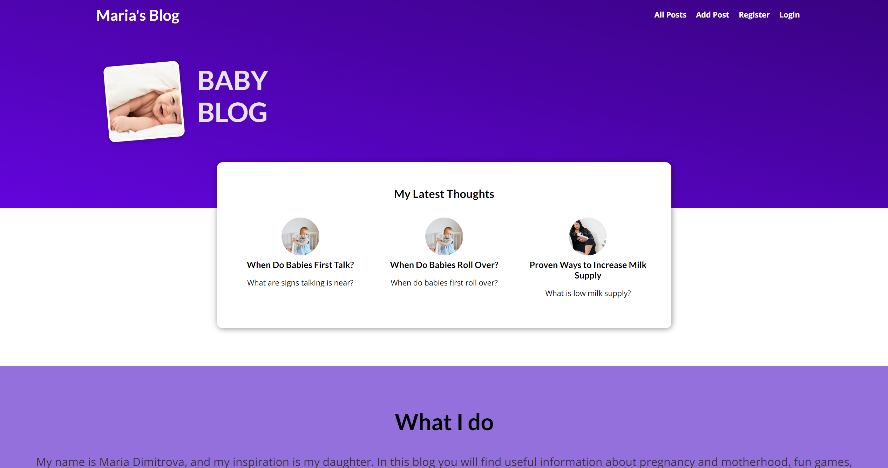
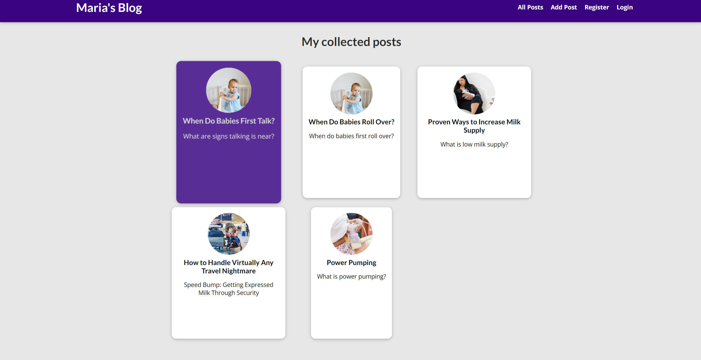
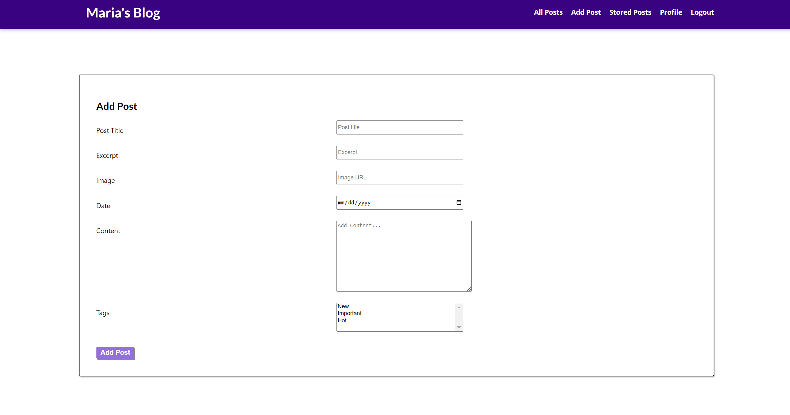
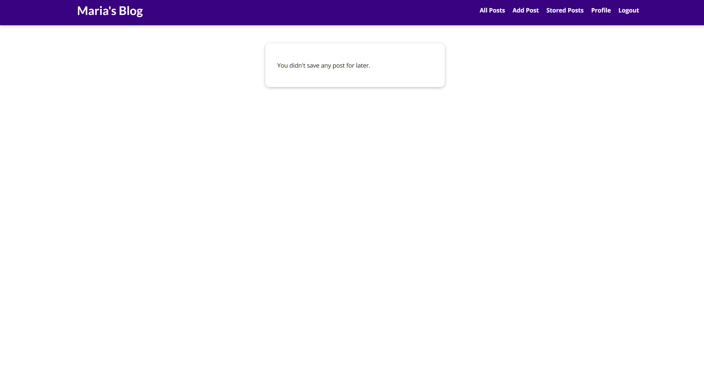
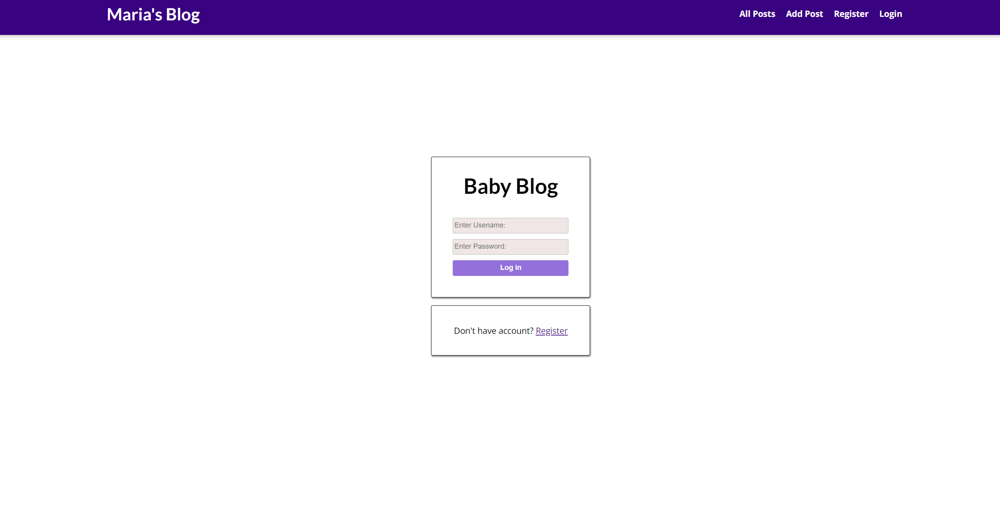
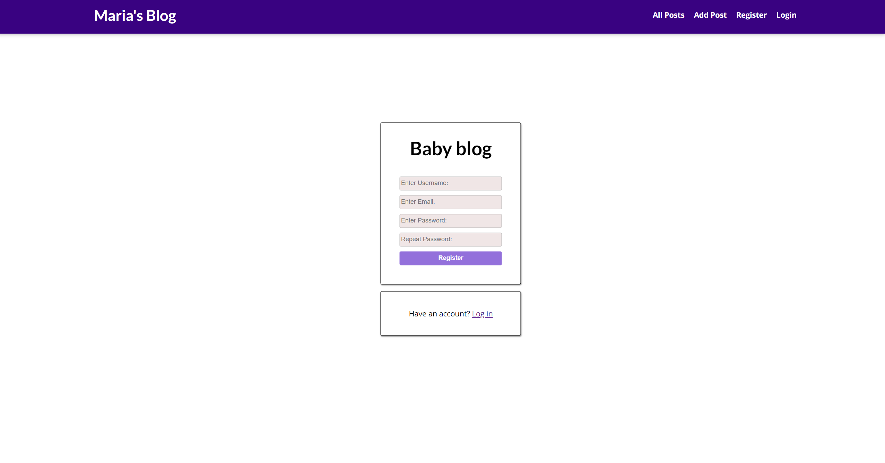
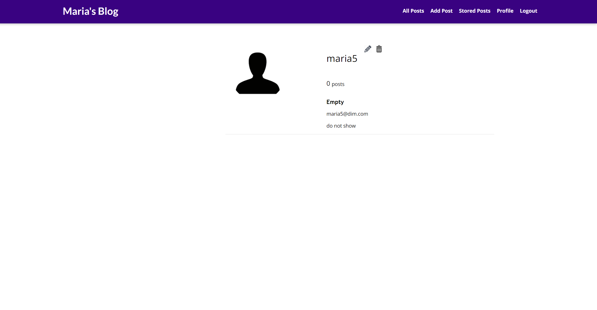

# Django Project Building A Baby Blog

Baby blog is a social networking platform where you will find useful information about pregnancy and motherhood, fun games, recipes and weekly menus, purchases and tricks to make everyday life easier.

### Features
User Registration and Profiles: Baby blog can create accounts, set up profiles, and personalize their experience.

Post Sharing and Interaction: Users can publish, view, read later and comment on posts related to baby topics.

### Tech Stack
Back-end: Django
Front-end: HTML, CSS
Database: PostgreSQL
Baby blog is built using Django, a high-level Python web framework, along with HTML and CSS for front-end design.

### Installation
Clone the repository: git clone https://github.com/midimitrova/Django-Project-Building-A-Baby-Blog.git
Navigate to the project directory: cd web_project
Install dependencies: pip install -r requirements.txt
Run migrations: python manage.py migrate
Start the development server: python manage.py runserver

### Screenshots

Starting Page

All Posts

Add Posts

Stored Posts

Login

Register

Profile
